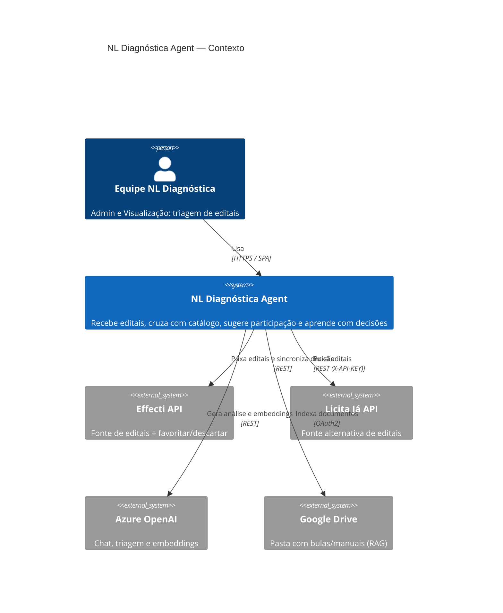
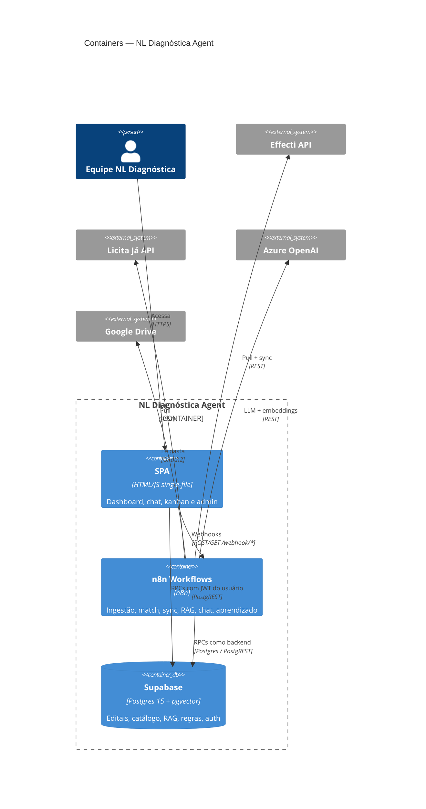
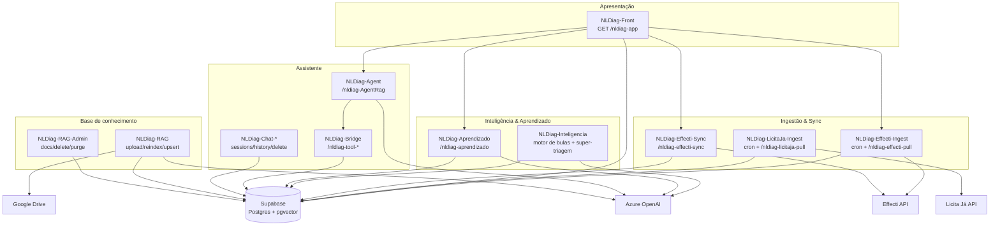
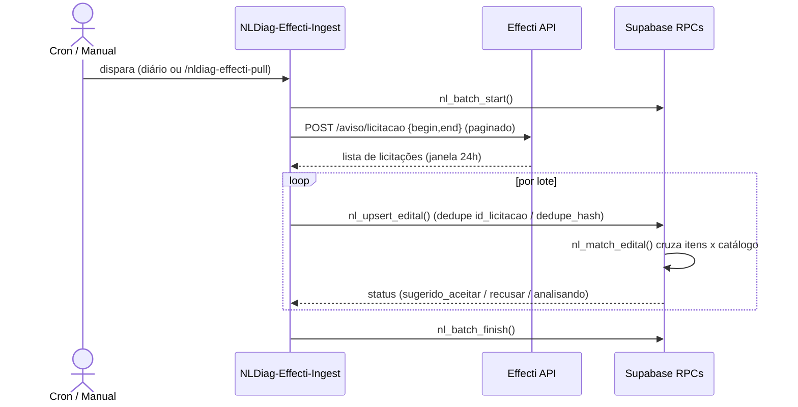
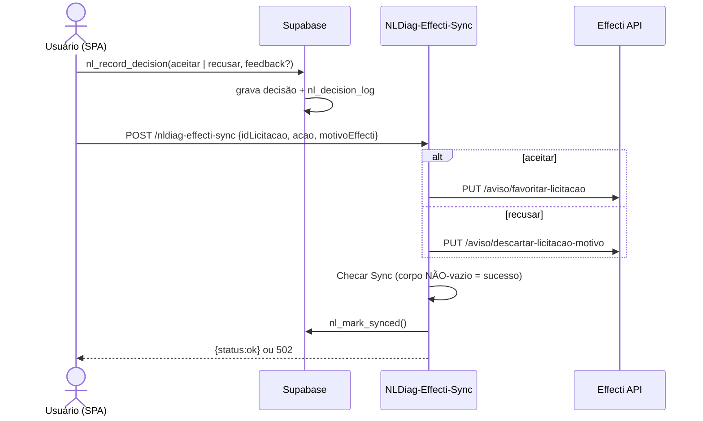
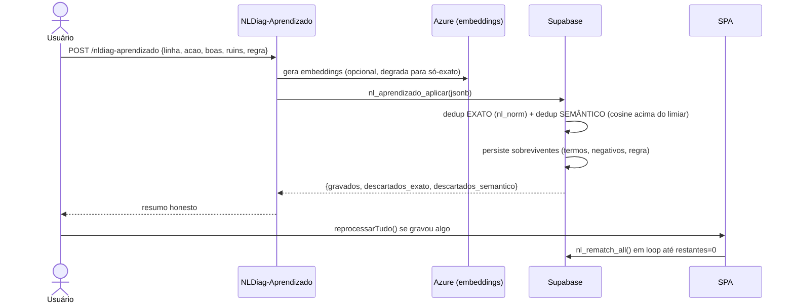
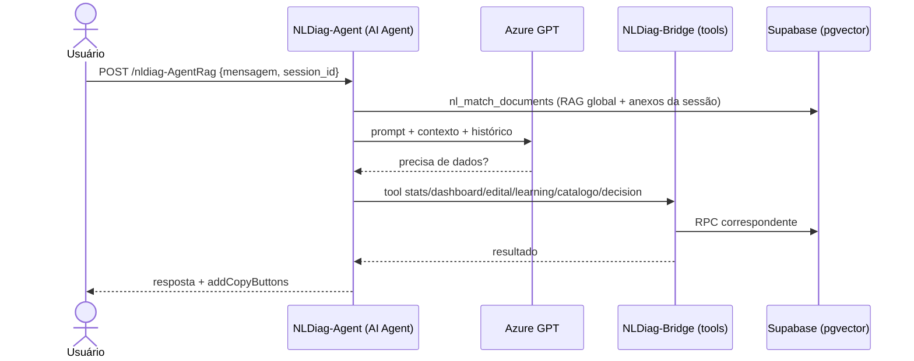
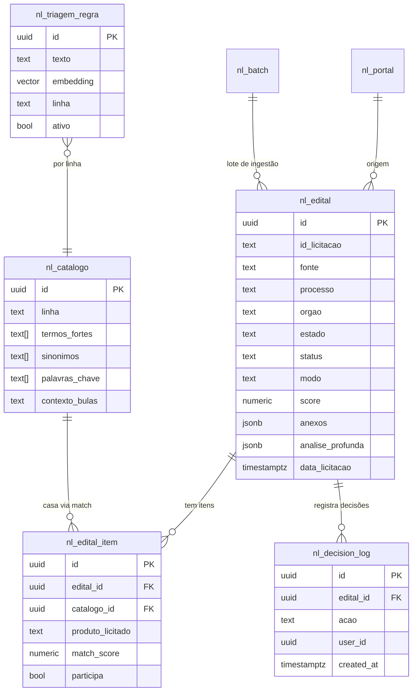
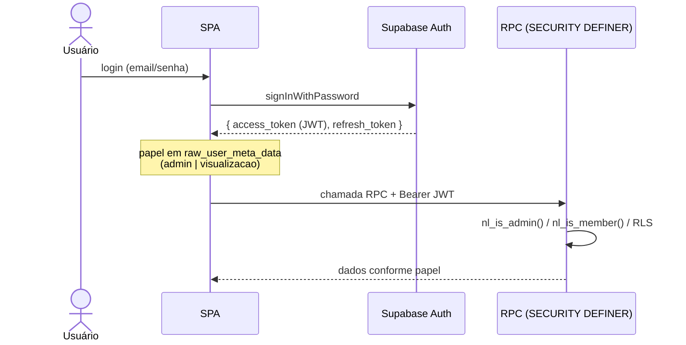

# Arquitetura — NL Diagnóstica Agent

> Arquitetura interna do serviço e como ele se encaixa nos sistemas externos.
> Setup e uso: [`README.md`](./README.md)

## Padrão Arquitetural

O NL Diagnóstica Agent **não é uma aplicação monolítica tradicional**: é um sistema
**orquestrado por workflows n8n** sobre um **banco Supabase (Postgres 15 + pgvector)**,
com uma **SPA single-file** (`front-nldiagnostica.html`) como camada de apresentação.

A regra de design central é **toda a lógica de negócio vive no banco**, exposta como
funções `RPC` (`SECURITY DEFINER`) em Postgres. O n8n e o front são clientes "burros"
dessas RPCs:

- **Front (SPA)** chama as RPCs com o **JWT do usuário** (passa pelas regras de papel/RLS).
- **n8n** chama as mesmas RPCs como role de banco/`service_role`; o helper `nl_is_backend()`
  libera as chamadas de backend sem burlar as regras de papel aplicadas ao front.

Esse padrão (lógica concentrada em RPCs versionadas por migrations) mantém o
comportamento consistente independentemente de quem chama, evita duplicar regras entre
n8n e front, e torna o reprocessamento (match, aprendizado) determinístico.

| Dimensão          | Escolha                                                      |
| ----------------- | ------------------------------------------------------------ |
| Orquestração / IA | n8n (workflows HTTP + cron + AI Agent)                       |
| Persistência      | Supabase — Postgres 15 + pgvector (HNSW)                     |
| Autenticação      | Supabase Auth (JWT) + RLS + papéis em `raw_user_meta_data`   |
| Apresentação      | SPA single-file servida por webhook n8n (`GET /nldiag-app`)  |
| IA / Embeddings   | Azure OpenAI (`gpt-*` chat + `text-embedding-3-small` 1536d) |
| Integrações       | Effecti API, Licita Já API, Google Drive (RAG)               |

## Diagrama de Contexto (C4 — Nível 1)

## Diagrama de Containers (C4 — Nível 2)

## Componentes Internos (workflows n8n)

## Fluxo de Ingestão e Match

`nl_match_edital` é o coração da triagem: cada item do edital é comparado às
palavras-chave/sinônimos/**termos fortes** do catálogo (posição via `ILIKE`),
bloqueado por **negativos globais** (`nl_match_negativo`), e recebe `score`,
`modo` de participação e `sugestao`. Editais sem itens cruzam o `objeto` com
termos fracos e caem em `analisando` (em vez de recusa silenciosa).

## Fluxo de Decisão e Sincronização

> **Gotcha:** corpo de resposta vazio = a execução n8n morreu no meio (falha
> silenciosa). O front valida corpo não-vazio antes de considerar sucesso.

## Fluxo de Aprendizado por Feedback (migration 023)

Dedup em 2 camadas evita inchar a base: **exato** (`nl_norm` = lower+unaccent+trim)
e **semântico** (embeddings + similaridade cosseno). Regras aprendidas entram no
prompt da super-triagem como "REGRAS DE NEGÓCIO APRENDIDAS" (a `REGRA DE OURO`
tem precedência).

## Fluxo do Assistente (RAG + ferramentas)

## Diagrama de Entidades (núcleo)

A camada RAG (`nl_document_metadata`, `nl_document_rows`, `nl_documents` com
`vector(1536)` + índice HNSW) é independente do domínio de editais e consultada
globalmente — sem ACL por equipe/categoria.

## Fluxo de Autenticação

> **Gotcha sandbox/origin null:** servindo o front pelo webhook `nldiag-app`,
> `navigator.locks` lança `SecurityError` e quebra o refresh do token. Fix:
> polyfill sempre sobrescreve `navigator.locks` e passar
> `lock: async (_n,_t,fn)=>fn()` em todos os `createClient`.

## Decisões de Arquitetura

### ADR-001: Lógica de negócio em RPCs do Postgres

- **Status:** Aceito
- **Contexto:** Front e n8n precisam do mesmo comportamento de match/decisão.
- **Decisão:** Concentrar regras em funções `SECURITY DEFINER`, versionadas por migrations.
- **Consequências:** Consistência e reprocessamento determinístico; porém a lógica
  fica em PL/pgSQL (menos testável que código de aplicação) e exige cuidado com RLS.

### ADR-002: Reprocesso em lotes (não em transação única)

- **Status:** Aceito
- **Contexto:** `nl_rematch_all` reprocessava ~350 editais numa transação → statement
  timeout do Supabase.
- **Decisão:** Flag `rematch_pending` + `nl_rematch_all(p_only_pending, p_limit)` que
  retorna `{reprocessados, restantes}`; o front chama em loop até `restantes=0`.
- **Consequências:** Sem timeout; custo de orquestração no cliente.

### ADR-003: Super-triagem assíncrona

- **Status:** Aceito
- **Contexto:** OCR/LLM de PDFs estourava o timeout (~100s) do proxy.
- **Decisão:** Responder `{status:processando}` imediatamente; o front faz polling de
  `analise_profunda_at` (5s, ~4min).
- **Consequências:** UX responsiva; complexidade de polling no front.

### ADR-004: Dedup em 2 camadas no aprendizado

- **Status:** Aceito
- **Contexto:** Feedback livre da equipe poderia inchar a base de termos/regras.
- **Decisão:** Dedup exato (`nl_norm`) + semântico (embeddings/cosine) com caps
  (texto ≤280, ≤20 regras ativas/linha); embeddings opcionais (degrada p/ só-exato).
- **Consequências:** Base enxuta e honesta; dependência opcional do Azure embeddings.

### ADR-005: RAG global sem ACL

- **Status:** Aceito
- **Contexto:** Equipe pequena; conhecimento (bulas/manuais) é compartilhado.
- **Decisão:** `nl_match_documents` sem filtro por equipe/categoria; anexos de chat
  isolados por `session_id` (migration 008).
- **Consequências:** Simplicidade; não atende multi-tenant.

## Segurança

- **Autenticação:** Supabase Auth (JWT). Papel em `raw_user_meta_data`
  (`role ∈ admin | visualizacao`, `company_name = 'nldiagnostica'`).
- **Autorização:** RLS + RPCs `SECURITY DEFINER`; helpers `nl_is_admin()`,
  `nl_is_member()`, `nl_is_backend()`. Catálogo, documentos e usuários: só `admin`.
- **Backend vs front:** o n8n usa role de banco/`service_role` (liberado por
  `nl_is_backend()`); o front usa o JWT do usuário e passa pelas regras de papel.
- **Segredos:** nenhum hardcoded no repositório — apenas placeholders `REPLACE_ME_*`.
  Token Effecti e senha de portal vivem **só** na credencial `Effecti-API` do n8n.
- **Interpolação SQL no n8n (gotcha):** usar `{{ $json.body.X || '' }}` para params
  de texto opcionais — chave ausente vira `undefined` literal e quebra o filtro.

## Performance

- **pgvector HNSW** nos embeddings (RAG e cache de termos) para busca aproximada rápida.
- **Ingestão e rematch em lotes** (`p_limit`) para evitar statement timeout.
- **Cache de embeddings de termos** (`nl_termo_embedding`) evita re-embeddar o catálogo.
- **Motor de bulas em lotes de 2 docs** (cap ~28k/doc) com resposta imediata p/ não
  estourar o timeout do proxy.
- **Super-triagem assíncrona + polling** em vez de request longo síncrono.
