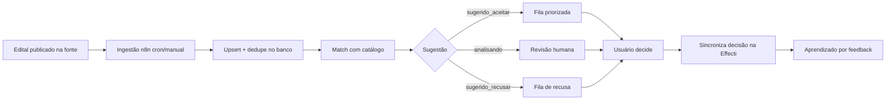
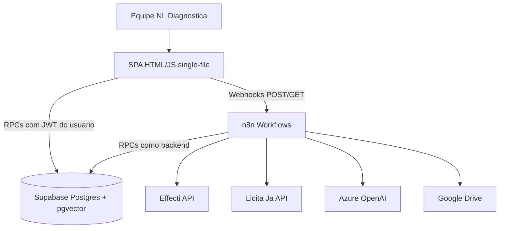
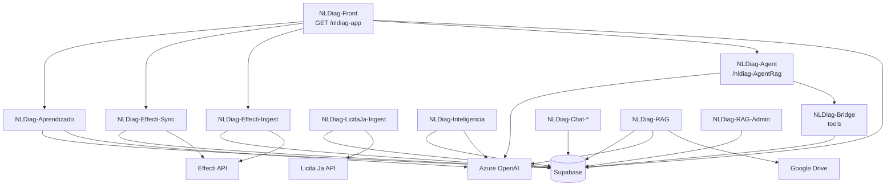
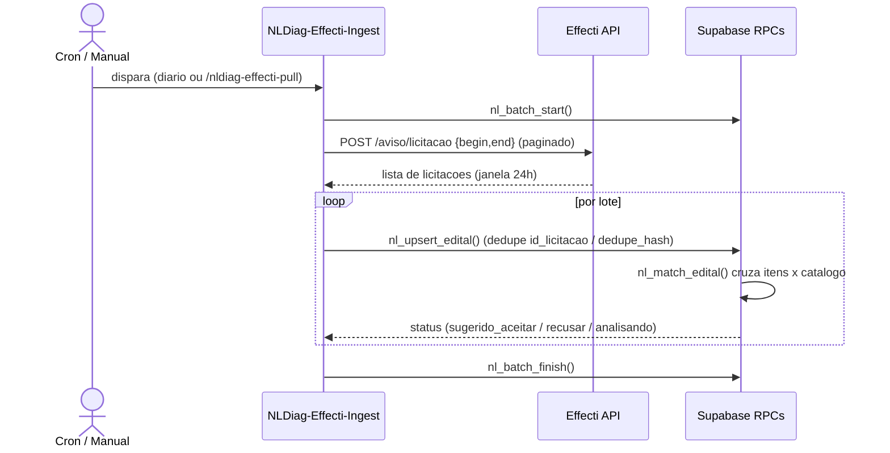
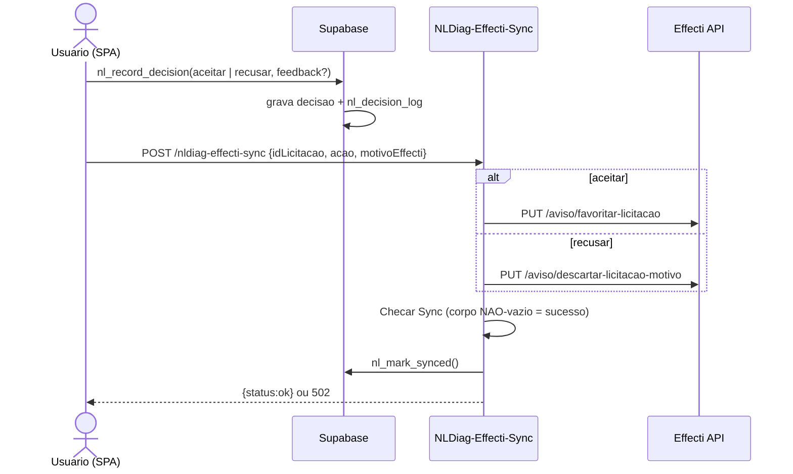
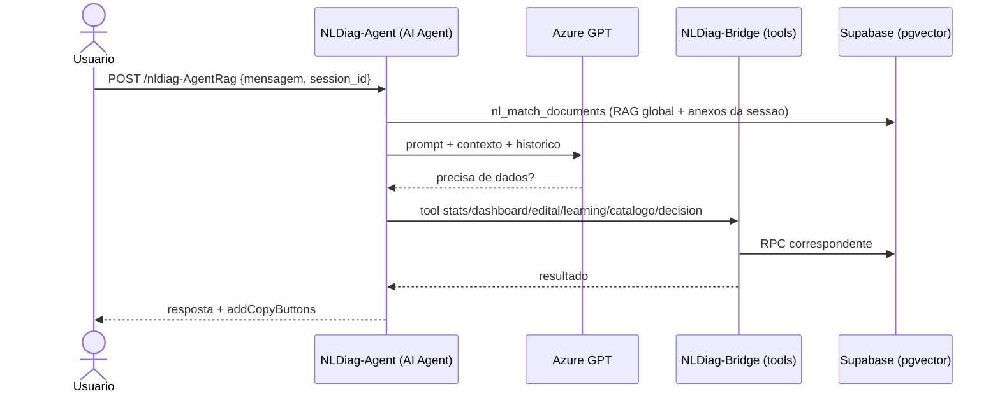
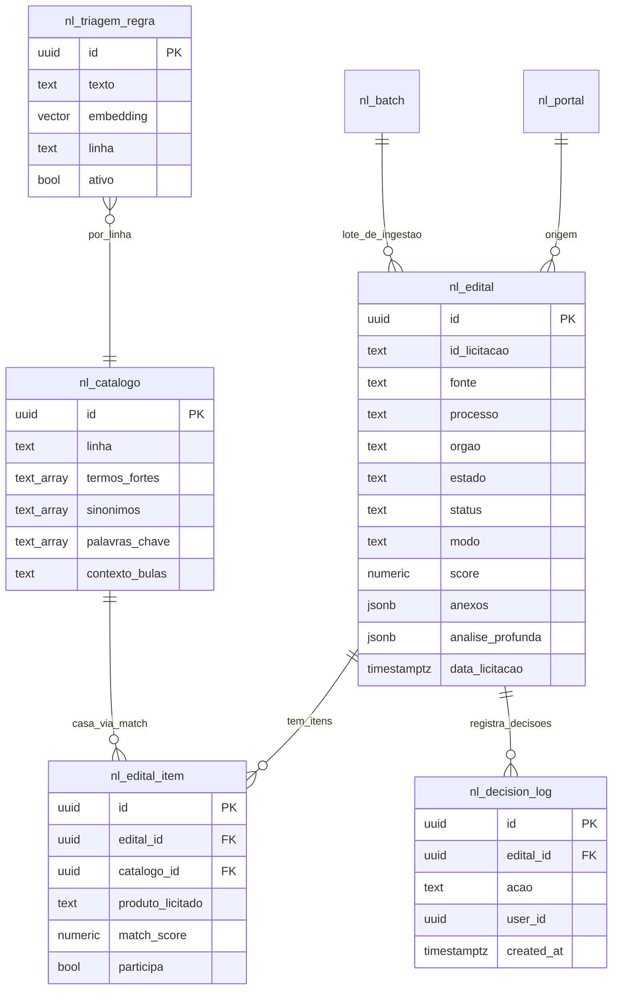

# NL Diagnóstica Agent — Documentação Técnica e de Negócio

## Sumário Executivo

O **NL Diagnóstica Agent** é um copiloto interno de **triagem de editais de licitação** para a empresa NL Diagnóstica, fabricante e distribuidora de produtos de **diagnóstico in vitro (IVD)**. O sistema **recebe editais** automaticamente (via API da Effecti, e preparado para Licita Já / ComprasNet), **cruza cada item** com o catálogo de produtos da empresa, **sugere participar ou recusar** (e como: por produto, por lote ou pelo edital inteiro) e **aprende** com as decisões da equipe para não repetir erros de triagem.

Não é uma aplicação monolítica tradicional: é um sistema **orquestrado por workflows n8n** sobre um banco **Supabase (Postgres 15 + pgvector)**, com uma **SPA single-file** (`front-nldiagnostica.html`) como camada de apresentação e **Azure OpenAI** para IA (chat, triagem profunda e embeddings).

> [!NOTE]
> **Regra de design central:** toda a lógica de negócio vive no banco, exposta como funções `RPC` (`SECURITY DEFINER`) em Postgres, versionadas por migrations. O n8n e o front são clientes "burros" dessas RPCs. Isso mantém o comportamento consistente independentemente de quem chama e torna o reprocessamento determinístico.

**Para quem:** equipe interna da NL Diagnóstica (perfis `admin` e `visualizacao`), responsável por avaliar oportunidades de licitação pública em saúde.

**Stack em uma frase:** n8n (orquestração + IA) + Supabase (Postgres 15 + pgvector + Auth) + Azure OpenAI + integrações Effecti / Licita Já / Google Drive.

---

## Visão de Negócio

### Propósito e problema resolvido

A NL Diagnóstica participa de licitações públicas de saúde (Secretarias de Saúde, hospitais, laboratórios de redes públicas). O volume de editais publicados diariamente é alto, e a maior parte **não tem aderência** ao portfólio da empresa. Avaliar manualmente cada edital — lendo objeto, itens e anexos — é lento e sujeito a erro.

O NL Diagnóstica Agent resolve isso ao:

- **Ingerir** os editais automaticamente das fontes integradas.
- **Cruzar** cada item licitado com o catálogo ativo (produto/serviço + finalidade de uso).
- **Sugerir** uma decisão (aceitar / recusar / revisar) com justificativa explicável.
- **Registrar** a decisão da equipe e **sincronizá-la** de volta na fonte (favoritar/descartar na Effecti).
- **Aprender** com o feedback, ajustando termos e regras de negócio para melhorar a triagem futura.

> [!TIP]
> O valor central é **filtrar ruído**: transformar centenas de editais brutos por dia numa fila curta e priorizada de oportunidades reais, com o "porquê" de cada sugestão.

### Atores e papéis

| Ator | Papel | Permissões principais |
| --- | --- | --- |
| **Administrador** (`admin`) | Gestor da operação | Gerencia catálogo, documentos (RAG), usuários, regras aprendidas; tudo que `visualizacao` faz |
| **Visualização** (`visualizacao`) | Analista de editais | Vê dashboard, abre editais, aceita/recusa, usa o assistente, dá feedback de triagem |
| **Backend (n8n)** | Serviço automatizado | Ingestão, match, sync, RAG e aprendizado via `nl_is_backend()` (role de banco/`service_role`) |
| **Sistemas externos** | Fontes/serviços | Effecti, Licita Já, Azure OpenAI, Google Drive |

O papel do usuário fica em `raw_user_meta_data` (`role ∈ admin | visualizacao`, `company_name = 'nldiagnostica'`).

### Jornadas / fluxos principais

**Jornada 1 — Da publicação à decisão**



**Jornada 2 — Análise assistida por IA**

O usuário abre o assistente (chat), pergunta sobre a fila ou um edital específico, e o agente explica o match item a item usando a base de conhecimento (RAG) e ferramentas de consulta ao banco. Quando solicitado, pode registrar decisões.

**Jornada 3 — Aprendizado contínuo**

Ao discordar de uma triagem, o usuário envia feedback (palavras boas/ruins e uma regra de negócio). O sistema deduplica (exato + semântico), persiste os sinais e dispara o reprocessamento de toda a base para refletir o aprendizado.

### Regras de negócio

| Regra | Descrição | Origem no código |
| --- | --- | --- |
| **Regra de Ouro** | A empresa só participa se os itens casarem com o catálogo ativo (produto/serviço + finalidade). Item sem correspondência = fora de escopo / a cadastrar; nunca inventar fornecimento | `rag-docs/01-empresa-nl-diagnostica.md`; prompt da super-triagem |
| **Escopo multilinha** | Não recusar parasitologia, eletroforese ou testes rápidos achando que a empresa "só faz Hemostasia" | `rag-docs/01`, catálogo (`nl_catalogo.linha`) |
| **Match exige termo forte** | Para sugerir participação, o item precisa casar com um **termo forte** da linha | `012_match_v2.sql`, `018_match_precisao_super_itens.sql` |
| **Bloqueio por negativos** | Termos negativos globais bloqueiam o match mesmo com palavra-chave presente | `nl_match_negativo` (`011`), `nl_match_edital` |
| **Score** | `score = LEAST(1.0, 0.4 + 0.2 × hits)` por posição (`ILIKE`) das palavras-chave | `005`/`006`, `migrations-clean/README.md` |
| **Modo de participação** | `total` (todos itens casam), `lote` (algum lote 100% fornecível), `produto` (parcial), `nenhum` | `nl_match_edital` |
| **Editais sem itens** | Cruzam o `objeto` com termos fracos e caem em `analisando` (sem recusa silenciosa) | `021_match_sem_itens.sql`, `012` |
| **Dedupe de editais** | `id_licitacao` único; fallback por `dedupe_hash = md5(processo\|orgao\|objeto)` | `005_licitacao_schema.sql` |
| **Dedup de aprendizado** | Exato (`nl_norm`) + semântico (cosine); caps texto ≤280, ≤20 regras ativas/linha | `023_aprendizado_triagem.sql` |
| **Motivos de recusa Effecti** | `FALTA_CAPACIDADE_TECNICA`, `LOCALIDADE_ENTREGA`, `VALOR_ESTIMADO_BAIXO`, `DOCUMENTACAO_INSUFICIENTE`, `PRAZO_ENTREGA_CURTO`, `OUTROS` | `workspaces/README.md`, `NLDiag-Effecti-Sync` |

### Entidades de domínio (glossário de negócio)

| Termo | Significado |
| --- | --- |
| **Edital** | Oportunidade de licitação pública ingerida de uma fonte, com órgão, processo, objeto, itens e anexos |
| **Item do edital** | Produto/serviço específico licitado dentro de um edital; é o que se cruza com o catálogo |
| **Catálogo** | Conjunto de produtos/serviços que a empresa fornece, organizado por **linha** (Hemostasia, Eletroforese, Parasitologia, Testes Rápidos) |
| **Linha** | Família de produtos (ex.: Hemostasia/Coagulação) com termos fortes, sinônimos e palavras-chave |
| **Match** | Cruzamento entre item licitado e catálogo, gerando `score`, `modo` e `sugestao` |
| **Triagem** | Classificação resultante: sugerido aceitar, sugerido recusar ou analisando |
| **Lote (batch)** | Conjunto de editais ingeridos numa execução; também há "lote" no sentido de agrupamento de itens do edital |
| **Decisão** | Ato do usuário de aceitar ou recusar; registrada em `nl_decision_log` e sincronizada na fonte |
| **RAG** | Base de conhecimento (bulas, manuais, finalidade de uso) consultada pelo assistente |
| **Regra aprendida** | Regra de negócio derivada de feedback humano que entra no prompt da super-triagem |

---

## Visão Técnica

### Stack e dependências

| Dimensão | Escolha |
| --- | --- |
| Orquestração / IA | n8n (workflows HTTP + cron + AI Agent) |
| Persistência | Supabase — Postgres 15 + pgvector (índice HNSW) |
| Autenticação | Supabase Auth (JWT) + RLS + papéis em `raw_user_meta_data` |
| Apresentação | SPA single-file servida por webhook n8n (`GET /nldiag-app`) |
| IA / Embeddings | Azure OpenAI (`gpt-4o-mini` chat + `text-embedding-3-small` 1536d) |
| Integrações | Effecti API, Licita Já API, Google Drive (RAG) |
| Front (libs CDN) | `@supabase/supabase-js@2`, `lucide` (ícones) |

### Arquitetura geral (containers)



### Estrutura de pastas

```text
nl-diagnostica-agent/
  front-nldiagnostica.html     # SPA (login + dashboard + chat + admin)
  ARCHITECTURE.md              # arquitetura, diagramas C4, ADRs
  README.md                    # setup e visão geral
  .scripts/
    build-front-workflow.ps1   # injeta o HTML no workflow NLDiag-Front.json
  migrations-clean/            # SQL Supabase (rodar 001 -> 023, na ordem)
  workspaces/                  # workflows n8n (importar)
  rag-docs/                    # base de conhecimento (linhas de produto, glossario)
  Docs/                        # PRDs e planos de implementacao
```

### Componentes internos (workflows n8n)



### Fluxo de uma operação ponta a ponta (ingestão + match)



### Fluxo de decisão e sincronização



> [!WARNING]
> **Gotcha:** corpo de resposta vazio = a execução n8n morreu no meio (falha silenciosa). O front valida corpo não-vazio antes de considerar sucesso.

### Fluxo do assistente (RAG + ferramentas)



### API / rotas / workflows

| Workflow | Tipo | Endpoint(s) | Função |
| --- | --- | --- | --- |
| `NLDiag-Front` | HTTP | `GET /nldiag-app` | Serve a SPA |
| `NLDiag-Agent` | IA | `POST /nldiag-AgentRag` | Assistente (Azure GPT-4o-mini) com memória, RAG global, RAG de conversa e 6 ferramentas |
| `NLDiag-Bridge` | Tools | `POST /nldiag-tool-*` | Ferramentas: stats, dashboard, edital, learning, catalogo, decision |
| `NLDiag-Effecti-Ingest` | Cron/HTTP | `POST /nldiag-effecti-pull` | Busca editais na Effecti, dedupe e match (lotes) |
| `NLDiag-Effecti-Sync` | HTTP | `POST /nldiag-effecti-sync` | Favoritar (aceitar) / descartar com motivo (recusar) |
| `NLDiag-LicitaJa-Ingest` | Cron/HTTP | `POST /nldiag-licitaja-pull` | Fonte alternativa de editais (Licita Já) |
| `NLDiag-Inteligencia` | IA | (motor) | Motor de bulas + super-triagem assíncrona |
| `NLDiag-Aprendizado` | HTTP | `POST /nldiag-aprendizado` | Aprendizado por feedback (embeddings + dedup) |
| `NLDiag-RAG` | IA | `POST /nldiag-rag-upload`, `/nldiag-rag-reindex`, `/nldiag-rag-upsert` | Ingestão da pasta Google Drive e upload unitário |
| `NLDiag-RAG-Admin` | HTTP | `GET /nldiag-rag-docs`, `POST /nldiag-rag-doc-delete`, `/nldiag-rag-purge-all` | Admin do RAG |
| `NLDiag-Chat-GET-Sessions` | HTTP | `GET /nldiag-sessions` | Lista conversas do usuário |
| `NLDiag-Chat-GET-History` | HTTP | `GET /nldiag-history` | Histórico de uma conversa |
| `NLDiag-Chat-DELETE-Session` | HTTP | `DELETE /nldiag-session` | Apaga uma conversa |

**Effecti API (referência):** base `https://mdw.minha.effecti.com.br/api-integracao/v1` (Swagger em `/api-integracao/swagger`).

- `POST /aviso/licitacao?page=0` body `{begin,end}` → lista de licitações
- `PUT /aviso/favoritar-licitacao` `{idLicitacao:[int]}` → **aceitar**
- `PUT /aviso/descartar-licitacao-motivo` → **recusar** com motivo

### Modelo de dados (entidades núcleo)



| Tabela | Propósito |
| --- | --- |
| `nl_portal` | Fontes de editais (EFFECTI, LICITAJA, COMPRASNET) |
| `nl_catalogo` | Catálogo de produtos por linha, com termos fortes/sinônimos/palavras-chave |
| `nl_batch` | Lote de ingestão (controle de execução) |
| `nl_edital` | Edital ingerido + resultado de triagem (status, modo, score, anexos, análise profunda) |
| `nl_edital_item` | Item licitado e seu match com o catálogo |
| `nl_decision_log` | Log de decisões (aceitar/recusar) por usuário |
| `nl_match_negativo` | Termos negativos globais que bloqueiam match |
| `nl_triagem_regra` | Regras de negócio aprendidas (com embedding) |
| `nl_termo_embedding` | Cache de embeddings de termos do catálogo |
| `nl_document_metadata` / `nl_document_rows` / `nl_documents` | Camada RAG (vetores 1536d, índice HNSW) |
| `nl_chat_message` | Memória de chat do assistente |

A camada RAG é **independente** do domínio de editais e consultada globalmente (sem ACL por equipe/categoria). Anexos de chat são isolados por `session_id` (migration `008`).

### Migrations (ordem de aplicação)

| Ordem | Arquivo | Conteúdo |
| --- | --- | --- |
| 001 | `001_users_and_admin.sql` | Helpers de papel + RPCs de usuários |
| 002 | `002_rag_schema.sql` | Tabelas e RPCs do RAG (global) |
| 003 | `003_match_documents.sql` | `nl_match_documents` (busca vetorial) |
| 004 | `004_chat_messages.sql` | Memória de chat + trigger de `user_id` |
| 005 | `005_licitacao_schema.sql` | Portais, catálogo, lotes, editais, itens, log |
| 006 | `006_licitacao_rpc.sql` | RPCs: ingestão, match, dashboard, decisão, aprendizado, stats |
| 007 | `007_seeds.sql` | Portais, catálogo Hemostasia (exemplos), admin inicial |
| 008 | `008_session_rag.sql` | Isolamento de anexos de conversa por `session_id` |
| 009 | `009_kanban_gestao.sql` | Gestão (kanban) dos editais aceitos |
| 010 | `010_editais_acoes_lote.sql` | Ações em lote (recusar sugeridos, apagar recusados) |
| 011 | `011_catalogo_termos.sql` | Termos fortes + `nl_match_negativo` |
| 012 | `012_match_v2.sql` | Match v2 (exige termo forte, bloqueia negativos) |
| 013 | `013_rematch_lotes.sql` | Reprocesso em lotes (corrige statement timeout) |
| 014–022 | vários | Pending sync, fontes LicitaJá, super-triagem, motor de bulas, precisão do match, parse de datas, anexos, dashboard de estado |
| 023 | `023_aprendizado_triagem.sql` | Aprendizado por feedback (dedup exato + semântico) |

### Integrações externas

| Integração | Uso | Auth |
| --- | --- | --- |
| **Effecti API** | Fonte principal de editais + favoritar/descartar | Header Auth (token na credencial `Effecti-API`) |
| **Licita Já API** | Fonte alternativa de editais | `X-API-KEY` |
| **Azure OpenAI** | Chat (`gpt-4o-mini`), super-triagem e embeddings (`text-embedding-3-small`) | Credencial Azure OpenAI |
| **Google Drive** | Pasta com bulas/manuais para o RAG | OAuth2 |

### Configuração e variáveis de ambiente

> [!DANGER]
> Nenhum segredo é versionado no repositório — apenas placeholders `REPLACE_ME_*`. O token da Effecti e a senha do portal vivem **somente** na credencial `Effecti-API` do n8n.

**Front (`front-nldiagnostica.html`, objeto `CONFIG`):**

| Chave | Propósito |
| --- | --- |
| `SUPABASE_URL` | URL do projeto Supabase |
| `SUPABASE_ANON_KEY` | Chave anônima do Supabase (cliente) |
| `N8N_BASE` | Base dos webhooks n8n |

**Credenciais n8n (placeholders a substituir):**

| Credencial | Tipo | Placeholder |
| --- | --- | --- |
| NLDiag-DB | Postgres | `REPLACE_ME_NLDIAG_DB` |
| Effecti-API | Header Auth | `REPLACE_ME_EFFECTI_CRED` |
| Azure OpenAI | Azure OpenAI | `REPLACE_ME_AZURE_OPENAI_CRED` |
| Supabase account | Supabase API | `REPLACE_ME_SUPABASE_CRED` |
| Google Drive account | OAuth2 | `REPLACE_ME_GDRIVE_CRED` |
| OCR (PDF digitalizado) | URL/deployment | `REPLACE_ME_AZURE_OCR_URL`, `REPLACE_ME_OCR_DEPLOYMENT` |
| Embeddings (aprendizado) | URL | `REPLACE_ME_AZURE_EMBEDDINGS_URL` |

### Segurança

- **Autenticação:** Supabase Auth (JWT). Papel em `raw_user_meta_data` (`role ∈ admin | visualizacao`, `company_name = 'nldiagnostica'`).
- **Autorização:** RLS + RPCs `SECURITY DEFINER`; helpers `nl_is_admin()`, `nl_is_member()`, `nl_is_backend()`. Catálogo, documentos e usuários: só `admin`.
- **Backend vs front:** o n8n usa role de banco/`service_role` (liberado por `nl_is_backend()`); o front usa o JWT do usuário e passa pelas regras de papel.
- **Segredos:** nenhum hardcoded; apenas placeholders `REPLACE_ME_*`.

> [!WARNING]
> **Gotcha sandbox/origin null:** servindo o front pelo webhook `nldiag-app`, `navigator.locks` lança `SecurityError` e quebra o refresh do token. Fix: polyfill sempre sobrescreve `navigator.locks` e passa `lock: async (_n,_t,fn)=>fn()` em todos os `createClient`.

> [!WARNING]
> **Interpolação SQL no n8n:** usar `{{ $json.body.X || '' }}` para params de texto opcionais — chave ausente vira `undefined` literal e quebra o filtro.

### Decisões de arquitetura (ADRs)

| ADR | Decisão | Consequência |
| --- | --- | --- |
| **001** | Lógica de negócio em RPCs do Postgres (`SECURITY DEFINER`) | Consistência e reprocessamento determinístico; lógica em PL/pgSQL é menos testável |
| **002** | Reprocesso em lotes (não em transação única) | Sem statement timeout; custo de orquestração no cliente |
| **003** | Super-triagem assíncrona (responde `processando` + polling) | UX responsiva; complexidade de polling no front |
| **004** | Dedup em 2 camadas no aprendizado (exato + semântico) | Base enxuta e honesta; dependência opcional do Azure embeddings |
| **005** | RAG global sem ACL | Simplicidade; não atende multi-tenant |

### Performance

- **pgvector HNSW** nos embeddings (RAG e cache de termos) para busca aproximada rápida.
- **Ingestão e rematch em lotes** (`p_limit`) para evitar statement timeout.
- **Cache de embeddings de termos** (`nl_termo_embedding`) evita re-embeddar o catálogo.
- **Motor de bulas em lotes de 2 docs** (cap ~28k/doc) com resposta imediata.
- **Super-triagem assíncrona + polling** em vez de request longo síncrono.

---

## Operação

### Pré-requisitos

- Extensão `vector` habilitada no Supabase (Database → Extensions).
- Supabase Auth ativo.
- Instância n8n com as credenciais configuradas.

### Setup do banco

Rode os SQLs de `migrations-clean/` **na ordem** (`001` → `023`) no SQL Editor do Supabase. Cada arquivo tem seção `UP` (aplicar) e comentários `DOWN` (reverter).

> [!NOTE]
> **Admin inicial** (criado em `007`): `admin@nldiagnostica.com.br` / `@Admin123`. **Troque a senha** após o primeiro login.

### Setup do n8n

1. Importe os JSON de `workspaces/` e substitua os placeholders `REPLACE_ME_*`.
2. Ordem de ativação sugerida:
   1. `NLDiag-Bridge` e `NLDiag-Agent` (chat).
   2. `NLDiag-Chat-*` (sessões/histórico).
   3. `NLDiag-Effecti-Sync` (para aceitar/recusar refletirem na Effecti).
   4. `NLDiag-Effecti-Ingest` (cron diário — ative com catálogo já populado).
   5. `NLDiag-RAG` / `NLDiag-RAG-Admin` (configure o Google Drive e dispare `POST /nldiag-rag-reindex`).
   6. `NLDiag-Front` (servir a SPA).

### Setup do front

Edite o objeto `CONFIG` no topo de `front-nldiagnostica.html` (`SUPABASE_URL`, `SUPABASE_ANON_KEY`, `N8N_BASE`) e publique via n8n:

```powershell
powershell -ExecutionPolicy Bypass -File .\.scripts\build-front-workflow.ps1
```

Depois importe/atualize `workspaces/NLDiag-Front.json` no n8n (a SPA fica em `GET /webhook/nldiag-app`). Também é possível abrir o HTML direto no navegador para testes.

---

## Lacunas e Recomendações

| Item | Situação | Recomendação |
| --- | --- | --- |
| Testes automatizados | Não identificados no repositório | Adicionar testes de RPC (pgTAP) e testes de fluxo dos workflows |
| Multi-tenant / ACL no RAG | Intencionalmente ausente (ADR-005) | Reavaliar se a base de conhecimento crescer entre equipes |
| Observabilidade dos workflows | Não documentada | Centralizar logs/alertas das execuções n8n (falhas silenciosas) |
| Versão exata de cada migration 014–022 | Resumida no README | Consultar o cabeçalho de cada arquivo SQL para detalhes finos |
| Detalhe interno dos prompts de IA | Vivem nos workflows n8n (JSON) | Documentar prompts da super-triagem e do agente em arquivo dedicado |

> [!TIP]
> Para detalhes finos de cada migration e dos prompts, consulte diretamente os arquivos em `migrations-clean/` e os JSON em `workspaces/`, além dos PRDs em `Docs/`.

---

## Anexos

### Arquivos-chave

| Arquivo | Conteúdo |
| --- | --- |
| `ARCHITECTURE.md` | Arquitetura, diagramas C4, fluxos de sequência, ADRs |
| `README.md` | Setup e visão geral |
| `migrations-clean/` | Schema e RPCs do banco (001–023) |
| `workspaces/` | Workflows n8n |
| `rag-docs/` | Base de conhecimento (linhas de produto, glossário, regras) |
| `Docs/` | PRDs e planos (precisão de busca, aprendizado, match, correções) |
| `front-nldiagnostica.html` | SPA (dashboard, chat, admin) |

### Documentos de produto (`Docs/`)

- `PRD-precisao-busca-editais.md` — precisão da busca de editais
- `PRD-aprendizado-triagem-feedback.md` — aprendizado por feedback
- `PRD-correcoes-pull-links-timeout.md` — correções de pull/links/timeout
- `PLANO-implementacao-match.md` / `PLANO-implementacao-aprendizado-triagem.md` — planos de implementação
- `LIMITACOES-integracoes.md` — limitações das integrações

### Linhas de produto (escopo de negócio)

1. **Hemostasia / Coagulação** — coagulômetros e reagentes (TP/INR, TTPA/APTT, fibrinogênio, dímero-D).
2. **Hemostasia Point of Care (Cascade Abrazo)** — química seca à beira-leito.
3. **Eletroforese capilar (V8 / SPIFE)** — proteínas séricas, hemoglobinopatias, imunofixação.
4. **Parasitologia (Coproplus / Coproplus Ultra)** — exame parasitológico de fezes (EPF).
5. **Testes rápidos** — imunocromatográficos.

> Certificações: ISO 13485 (BSI) e Operador Econômico Autorizado (OEA). Mais de 30 anos no segmento de diagnóstico in vitro.
